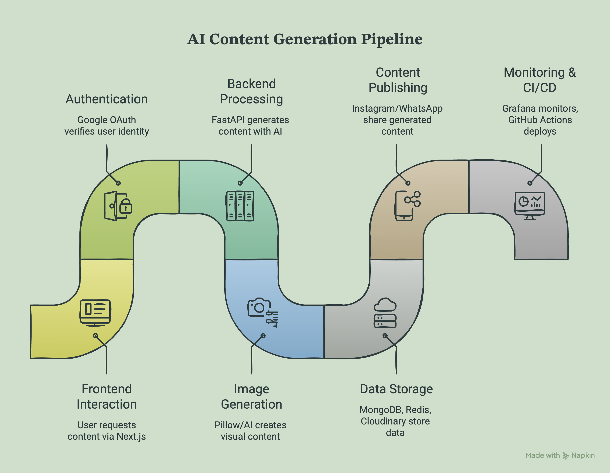
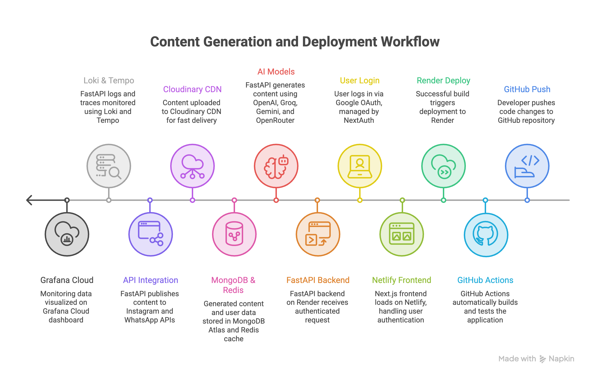
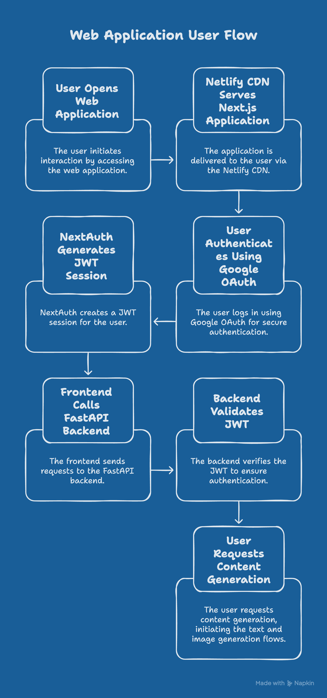
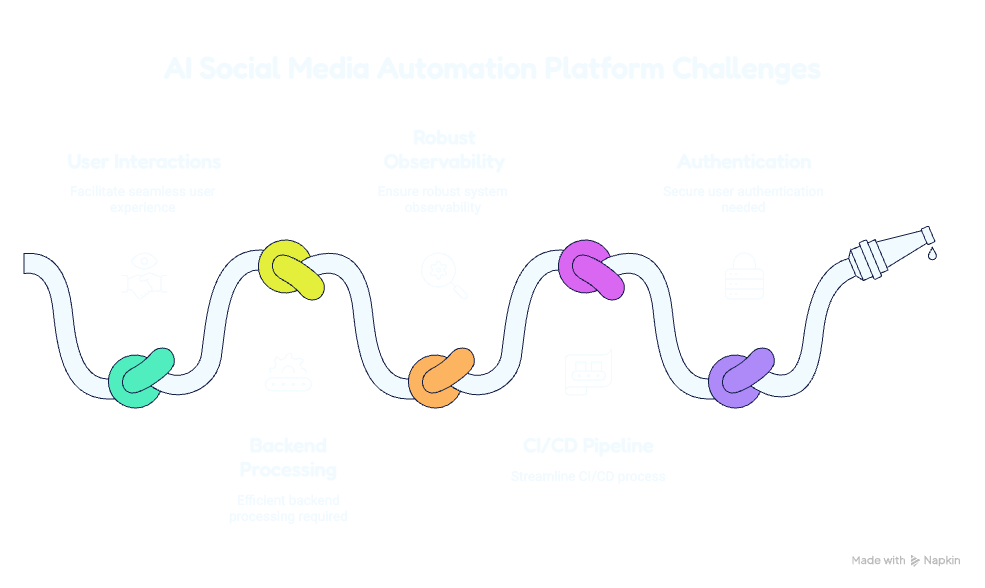
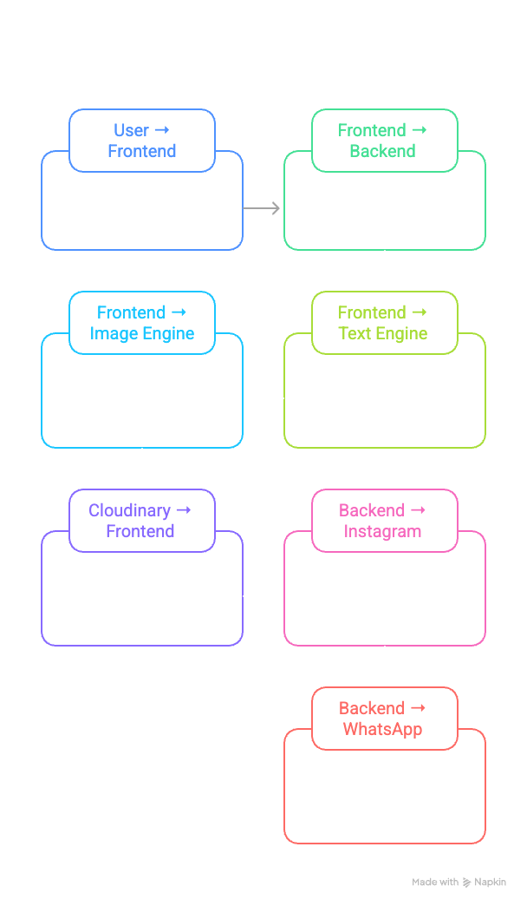

<div align="center">

# DevOps Runtime Emotions AI Studio

**Auto-generate DevOps-themed Instagram humor using AI — memes, text cards, incident posts — with one-click sharing to WhatsApp and Instagram.**

[](https://www.python.org)
[](https://fastapi.tiangolo.com)
[](https://nextjs.org)
[](https://www.typescriptlang.org)
[](https://www.mongodb.com/atlas)
[](https://grafana.com)
[](LICENSE)

**[Live Demo](https://web.gudditinaganjaneyulu.qzz.io)** · **[API Docs](https://api.gudditinaganjaneyulu.qzz.io/docs)** · **[Grafana Dashboard](https://ganji7337.grafana.net/public-dashboards/5fc1b2b6533245709312e59c897a2372)**



</div>

---

## How It Works — At a Glance

> Pick a category → AI writes the joke → Pillow renders the card → share to Instagram in one tap.



*Every component from GitHub push to Instagram share — Grafana monitors it all in real time.*

---

## System Architecture

| Components | User Flow |
|:---:|:---:|
|  |  |
| **6 layers:** Frontend · Backend · AI Engines · Data · Observability · External APIs | **Auth path:** Browser → Netlify → NextAuth → Google OAuth → FastAPI JWT validation |

---

## What It Does

Users log in with Google, pick a DevOps category and tone, hit Generate — and within seconds get a styled 1080×1080 Instagram card with a caption, hashtags, and one-click share to WhatsApp or Instagram. No design skills needed.

| Feature | What happens |
|---|---|
| **Content Generation** | Pick category + tone → 4-provider AI text chain → 5-provider image chain → 1080×1080 card |
| **Incident Analyzer** | Paste `CrashLoopBackOff` / `OOMKilled` / Terraform error → AI root cause + meme |
| **Trend Engine** | Monitors Reddit `r/devops` + Hacker News → auto-generates trending content |
| **Scheduler** | Generates 1–5 posts daily, hands-free, no manual trigger needed |
| **Observability** | Structured JSON logs → Grafana Loki · OTLP traces → Grafana Tempo |
| **Social Sharing** | WhatsApp deep link · Instagram Web Share API (native mobile share sheet) |



---

## Architecture

```
┌────────────────────────────────────────────────────────────────────┐
│                        User's Browser                             │
│   Next.js 15 · React 19 · TypeScript · Tailwind · Zustand        │
│   TanStack Query · NextAuth v5 · Framer Motion                    │
└──────────────┬───────────────────────────────────────┬────────────┘
               │  HTTPS (Netlify CDN)                  │ Share
               ▼                                       ▼
┌──────────────────────────┐              ┌────────────────────────┐
│   FastAPI Backend        │              │  WhatsApp Web API      │
│   Python 3.12 · Render   │              │  Web Share API (mobile)│
│                          │              └────────────────────────┘
│  ┌──────────────────┐    │
│  │  Text Engine     │    │◄── Google OAuth (NextAuth v5 + JWT)
│  │  OpenAI          │    │
│  │   → Groq         │    │◄── MongoDB Atlas (Motor async)
│  │   → Gemini       │    │
│  │   → OpenRouter   │    │◄── Upstash Redis (rate limiting + cache)
│  └──────────────────┘    │
│                          │◄── Cloudinary (image storage + CDN)
│  ┌──────────────────┐    │
│  │  Image Engine    │    │
│  │  TextCard(Pillow)│    │
│  │   → Pollinations │    │
│  │   → StableHorde  │    │
│  │   → HuggingFace  │    │
│  │   → GeminiImage  │    │
│  └──────────────────┘    │
│                          │
│  ┌──────────────────┐    │
│  │  Observability   │────┼──► Grafana Loki  (structured JSON logs)
│  │  structlog JSON  │    │    Grafana Tempo (OTLP traces)
│  └──────────────────┘    │
└──────────────────────────┘
```

---

## How It Works — Complete Flow



### 1. Authentication Flow


```
User visits app
      │
      ▼
Next.js checks NextAuth session
      │
      ├─ No session ──► /login page
      │                      │
      │               Click "Sign in with Google"
      │                      │
      │               NextAuth redirects → Google OAuth consent screen
      │                      │
      │               Google returns { id_token, profile }
      │                      │
      │               NextAuth callback:
      │                 1. Sends id_token to FastAPI POST /api/v1/auth/google
      │                 2. FastAPI verifies token with Google's public keys
      │                 3. Upserts user in MongoDB (create if first login)
      │                 4. Returns signed JWT (HS256, 24h expiry)
      │                 5. NextAuth stores JWT in encrypted httpOnly cookie
      │                      │
      └─ Has session ─────────┤
                              ▼
                    All API calls inject JWT via
                    Axios request interceptor:
                    Authorization: Bearer <jwt>
                              │
                              ▼
                    FastAPI dependency get_current_user()
                    decodes JWT → resolves user → injects into route
```

**Why JWT over sessions:** Render.com free tier can spin down between requests. JWT is stateless — no session store needed. The frontend (Netlify) and backend (Render) are on different domains, so cookies won't work cross-origin; the JWT is sent in the Authorization header instead.

---

### 2. Content Generation Flow — End to End

This is the core pipeline. Every `POST /api/v1/generate/` request runs through this sequence:

```
Browser                    FastAPI                   External Services
  │                           │
  │  POST /api/v1/generate/   │
  │  { category, tone,        │
  │    content_type, context } │
  │──────────────────────────►│
  │                           │
  │                    ┌──────┴──────────────────────────────────┐
  │                    │ 1. AUTH                                  │
  │                    │    JWT decoded → user loaded from MongoDB│
  │                    │    Daily limit checked in Redis          │
  │                    │    (INCR user:{id}:today_count)          │
  │                    └──────┬──────────────────────────────────┘
  │                           │
  │                    ┌──────┴──────────────────────────────────┐
  │                    │ 2. MONGO — create pending generation doc │
  │                    │    status: "processing"                  │
  │                    │    Returns generation_id immediately     │
  │                    └──────┬──────────────────────────────────┘
  │                           │
  │                    ┌──────┴──────────────────────────────────┐
  │                    │ 3. TEXT ENGINE                           │
  │                    │                                          │
  │                    │  build_meme_prompt(category, tone)       │
  │                    │    └─► 6 structured prompt formats       │
  │                    │        Indian IT flavor injected          │
  │                    │        ALL_CAPS rules enforced in prompt  │
  │                    │                                          │
  │                    │  Provider chain (first success wins):    │
  │                    │  ┌─ OpenAI gpt-4o-mini ─────────────┐   │
  │                    │  │  POST api.openai.com/chat/completions │
  │                    │  │  429 / error → next provider      │   │
  │                    │  ├─ Groq llama-3.3-70b ─────────────┤   │
  │                    │  │  POST api.groq.com/...            │   │
  │                    │  ├─ Gemini gemini-2.0-flash ─────────┤   │
  │                    │  └─ OpenRouter (free models) ─────────┘  │
  │                    │                                          │
  │                    │  Response parsed → JSON extracted:       │
  │                    │  { joke_text, caption, hashtags,         │
  │                    │    image_prompt }                        │
  │                    └──────┬──────────────────────────────────┘
  │                           │
  │                    ┌──────┴──────────────────────────────────┐
  │                    │ 4. IMAGE ENGINE                          │
  │                    │                                          │
  │                    │  Provider chain (first success wins):    │
  │                    │                                          │
  │                    │  ┌─ TextCard (Pillow — always first) ──┐ │
  │                    │  │  joke_text → measure each line       │ │
  │                    │  │  pick font size (60→54→48→42→36px)  │ │
  │                    │  │  render dark bg + colored ALL_CAPS   │ │
  │                    │  │  draw </> divider + footer           │ │
  │                    │  │  return PNG bytes                    │ │
  │                    │  │  (never fails — always succeeds)     │ │
  │                    │  ├─ Pollinations.ai ──────────────────┤  │
  │                    │  │  GET image.pollinations.ai/prompt/…  │ │
  │                    │  ├─ Stable Horde (async poll) ─────────┤ │
  │                    │  │  POST /api/v2/generate/async          │ │
  │                    │  │  Poll /check/{id} every 5s, 90s max  │ │
  │                    │  ├─ HuggingFace SD 1.5 ───────────────┤  │
  │                    │  └─ Gemini image generation ────────────┘ │
  │                    └──────┬──────────────────────────────────┘
  │                           │
  │                    ┌──────┴──────────────────────────────────┐
  │                    │ 5. CLOUDINARY UPLOAD                     │
  │                    │    PNG bytes → multipart POST            │
  │                    │    Cloudinary returns:                   │
  │                    │      secure_url (full 1080px)            │
  │                    │      thumbnail_url (400px, auto-cropped) │
  │                    └──────┬──────────────────────────────────┘
  │                           │
  │                    ┌──────┴──────────────────────────────────┐
  │                    │ 6. MONGO UPDATE                          │
  │                    │    status: "completed"                   │
  │                    │    image_url, thumbnail_url saved        │
  │                    │    text_provider, image_provider logged  │
  │                    │    generation_time_ms recorded           │
  │                    └──────┬──────────────────────────────────┘
  │                           │
  │  201 Created              │
  │  { id, joke_text,         │
  │    caption, hashtags,     │
  │    image_url,             │
  │    thumbnail_url,         │
  │    text_provider,         │
  │    generation_time_ms }   │
  │◄──────────────────────────│
  │
  ▼
Browser renders:
  • Animated image reveal (Framer Motion)
  • joke_text in monospace card preview
  • caption + hashtag row (purple)
  • Copy Caption button → navigator.clipboard
  • Download button → backend /download redirect
  • Share row → WhatsApp / Instagram
```

**Total time:** 3–8 seconds (TextCard path: ~1s, OpenAI path: ~3s, Stable Horde: up to 90s)

---

### 3. Text Engine — Provider Fallback in Detail

```python
# Simplified logic inside text_engine.py

async def generate(prompt_request) -> TextResult:
    for provider in [OpenAIProvider, GroqProvider, GeminiProvider, OpenRouterProvider]:
        try:
            result = await provider.complete(system_prompt, user_prompt)
            json_data = extract_json(result)          # strips markdown fences
            validate_fields(json_data)                # ensures all keys present
            log.info("Text generation succeeded", provider=provider.name)
            return TextResult(**json_data)
        except RateLimitError:
            log.warning("Provider rate limited", provider=provider.name)
            continue                                  # try next provider
        except (JSONDecodeError, ValidationError):
            log.warning("Bad JSON from provider", provider=provider.name)
            continue
    raise AllProvidersExhaustedError()
```

Each provider call includes:
- **System prompt** — humor rules, format constraints, Indian IT archetypes, ALL_CAPS limits
- **User prompt** — specific category context + chosen format (A–F) + tone instructions
- **Temperature 0.85** — creative enough for humor, stable enough for JSON

---

### 4. Pillow Text Card Renderer — Step by Step

The most technically interesting component. No AI image API is needed.

```
Input: joke_text string (multi-line, with \n and \n\n)
                │
                ▼
        ┌───────────────────────────────┐
        │ 1. PARSE LINES                │
        │    Split on \n                │
        │    Empty line → stanza gap    │
        │    Detect line type:          │
        │      • Speaker: "Manager:"   │
        │      • Code: "kubectl apply" │
        │      • Regular text          │
        └───────────┬───────────────────┘
                    │
                    ▼
        ┌───────────────────────────────┐
        │ 2. MEASURE + PICK FONT SIZE   │
        │    Try 60px → 54 → 48 → 42   │
        │    At each size, wrap lines   │
        │    that exceed 26 chars       │
        │    Pick largest size where    │
        │    total lines fit in canvas  │
        └───────────┬───────────────────┘
                    │
                    ▼
        ┌───────────────────────────────┐
        │ 3. RENDER — 1080×1080 canvas  │
        │    Background: #080808        │
        │    For each token in a line:  │
        │      WORD_LIKE_THIS →         │
        │        rotating color cycle   │
        │        (red/green/blue/       │
        │         purple/cyan/orange)   │
        │      "Speaker:" →             │
        │        dim gray #828282       │
        │      code command →           │
        │        cyan #00FFFF           │
        │      regular word →           │
        │        white                  │
        │    Stanza gap = 1× cap height │
        └───────────┬───────────────────┘
                    │
                    ▼
        ┌───────────────────────────────┐
        │ 4. DRAW DIVIDER + FOOTER      │
        │    Horizontal rules (gray)    │
        │    Center: </> in purple      │
        │    Bottom: @devopsemotions    │
        └───────────┬───────────────────┘
                    │
                    ▼
        Output: PNG bytes (avg ~35KB)
        Upload time to Cloudinary: ~3s
```

---

### 5. Incident Analyzer Flow

```
User pastes raw error log
(e.g. "Back-off restarting failed container
        CrashLoopBackOff: Error 1")
          │
          ▼
POST /api/v1/incidents/analyze
          │
          ▼
┌─────────────────────────────────────┐
│ 1. CLASSIFY ERROR TYPE              │
│    Regex patterns checked first:    │
│    CrashLoopBackOff, OOMKilled,     │
│    ImagePullBackOff, TerraformError │
│    AWSBillingSpike, DockerBuildFail │
│                                     │
│    If no regex match →              │
│    LLM classifies from raw text     │
└──────────────┬──────────────────────┘
               │
               ▼
┌─────────────────────────────────────┐
│ 2. ANALYZE — LLM incident prompt    │
│    System: DevOps SRE expert persona│
│    User: error_type + raw_input     │
│                                     │
│    Returns JSON:                    │
│    { root_cause,                    │
│      funny_caption,                 │
│      suggested_fix,                 │
│      joke_text,                     │
│      image_prompt }                 │
└──────────────┬──────────────────────┘
               │
               ▼
┌─────────────────────────────────────┐
│ 3. IMAGE — same 5-provider chain    │
│    joke_text → TextCard (Pillow)    │
└──────────────┬──────────────────────┘
               │
               ▼
┌─────────────────────────────────────┐
│ 4. SAVE → incidents collection      │
│    References generations._id       │
└──────────────┬──────────────────────┘
               │
               ▼
Response: root cause + fix + meme image
```

---

### 6. Trend Engine Flow

```
APScheduler (every 6 hours)
          │
          ▼
trend_service.refresh_trends()
          │
    ┌─────┴────────────────────────────────┐
    │                                      │
    ▼                                      ▼
Reddit API                          HackerNews Algolia API
r/devops, r/kubernetes, r/aws       /search?query=kubernetes&tags=story
GET /r/{sub}/hot.json               GET hn.algolia.com/api/v1/search
(public API, no auth needed)
    │                                      │
    └─────────────────┬────────────────────┘
                      │
                      ▼
          deduplicate_and_score()
          - Normalize titles
          - Score = upvotes + (comments × 2)
          - Group by topic similarity
          - Top 20 stored in Redis (6h TTL)
          - Persisted to MongoDB trends collection
                      │
                      ▼
          GET /api/v1/trends → frontend
          User clicks "Generate" on a trend
                      │
                      ▼
          Same text + image pipeline
          Prompt includes trend title + source
          Result linked to trend._id
```

---

### 7. Scheduler Flow (Hands-Free Daily Posts)

```
App startup → APScheduler initialized
                    │
                    ▼
         Reads SCHEDULER_HOUR + SCHEDULER_MINUTE from env
         Registers daily job: daily_generation()
                    │
         ┌──────────┘ (fires daily at configured time)
         │
         ▼
daily_generation():
  1. Pick N categories (default 3) from CATEGORY_CONTEXTS
     Weighted towards high-performing categories (from analytics)
  2. For each category:
       generate_single(category, tone="sarcastic", type="meme")
       → same full pipeline (text → image → Cloudinary → MongoDB)
  3. Log results to structlog → Loki
  4. Update analytics counters in MongoDB
         │
         ▼
  All generated posts appear in gallery
  Users see them next time they open the app
```

---

### 8. Observability Flow — Logs to Grafana Loki

**[View Live Grafana Dashboard →](https://ganji7337.grafana.net/public-dashboards/5fc1b2b6533245709312e59c897a2372)**

```
Code calls:
  logger.info("Generation completed", ms=6483, provider="groq")
          │
          ▼ structlog processes event dict through chain:
  [merge_contextvars]         adds request-scoped context
  [add_log_level]             adds "level": "info"
  [add_logger_name]           adds "logger": "app.services.generation_service"
  [TimeStamper(fmt="iso")]    adds "timestamp": "2026-06-07T08:57:30Z"
  [JSONRenderer()]            serializes entire dict to JSON string
          │
          ▼ structlog calls stdlib logger (stdlib.LoggerFactory)
  logging.getLogger("app.services.generation_service").info(json_string)
          │
          ▼ Python root logger distributes to all handlers
    ┌─────┴────────────────────┐
    │                          │
    ▼                          ▼
StreamHandler               _LokiHandler (our custom handler)
(stdout → Render logs)       emit(record):
                               ts_ns = time.time() * 1e9
                               payload = {
                                 "streams": [{
                                   "stream": {
                                     "app": "devops-runtime-emotions",
                                     "env": "production",
                                     "level": "info"
                                   },
                                   "values": [[ts_ns, json_string]]
                                 }]
                               }
                               httpx.post(LOKI_URL, json=payload,
                                          auth=(username, password))
                                          │
                                          ▼
                                  Grafana Loki ingests stream
                                  Available in Explore within ~5s

Grafana LogQL queries derive metrics:
  count_over_time → generation rate
  | unwrap ms → latency histograms
  sum by (provider) → provider breakdown
```

---

### 9. Social Sharing Flow

```
User clicks "WhatsApp"                User clicks "Instagram"
        │                                      │
        ▼                                      ▼
Build share text:                   Check navigator.share support
  caption                                  │
  + hashtags (#devops #kubernetes…)   ┌────┴────────────────────────┐
  + image_url (Cloudinary)            │ Mobile browser (Chrome/Safari)│
        │                             │                              │
        ▼                             │  1. fetch(imageUrl)          │
window.open(                          │     → Blob (PNG/JPG)         │
  "https://api.whatsapp.com/send      │  2. new File([blob], ...)    │
   ?text=<encoded>",                  │  3. navigator.canShare({     │
  "_blank"                            │       files: [file] })       │
)                                     │  4. navigator.share({        │
        │                             │       files: [file],         │
        ▼                             │       text: caption          │
WhatsApp Web opens                    │     })                       │
(or WhatsApp app on mobile)           │  5. Native share sheet opens │
Pre-filled message with               │     User picks Instagram     │
caption + image link                  │  6. Image lands in           │
User sends to any chat/group          │     Instagram Create Post    │
                                      └──────────────────────────────┘
                                             │ Desktop browser
                                             ▼
                                      navigator.share not available
                                             │
                                      window.open(downloadUrl)
                                      Image downloads to device
                                             │
                                      Amber hint appears:
                                      "Image downloaded — open
                                       Instagram and post from
                                       your camera roll"
                                      (auto-hides after 5s)
```

---

### 10. Gallery — Infinite Scroll Flow

```
User opens /gallery
          │
          ▼
useGallery hook (TanStack Query)
  GET /api/v1/gallery?limit=12&page=1
          │
          ▼
Backend:
  MongoDB query with cursor pagination
  Filter by category (if selected)
  Sort by created_at DESC
  Returns { items[], total, pages }
          │
          ▼
Frontend renders masonry grid
(CSS columns, not JS masonry library)
          │
          ▼
User scrolls near bottom
  IntersectionObserver fires
  fetchNextPage() called
  GET /api/v1/gallery?page=2
  New items appended to grid
  Framer Motion animates entry

Desktop hover → overlay appears:
  [WA icon] [IG icon] [Download icon]
  (opacity-0 → opacity-100 via group-hover)

Mobile → share row always visible
  below caption in each card
```

---

## Key Engineering Decisions

### 1. Pillow-first Image Generation
Instead of relying on AI image generators (costly, slow, unreliable), the primary renderer is a **custom Pillow-based text card engine** that produces pixel-perfect 1080×1080 PNG cards matching the @runtimeemotions aesthetic:
- Dark background (`#080808`), monospace bold font, `</>` divider
- ALL_CAPS keywords in rotating syntax-highlight colors (red / green / blue / cyan / orange)
- Speaker labels dimmed gray, code commands in cyan
- Adaptive font sizing (60px → 36px) based on line count and character width
- Stanza gap detection for dialogue formatting
- No external API dependency — always works, zero cost

AI image providers (Pollinations → Stable Horde → HuggingFace → Gemini Image) serve as fallback only.

### 2. Multi-Provider AI Fallback Chain
The system never fails on a single provider outage or rate limit:

**Text generation:**
```
OpenAI (gpt-4o-mini) → Groq (llama-3.3-70b) → Gemini (gemini-2.0-flash) → OpenRouter
```
Each provider is tried in sequence. On `429 Rate Limit` or network error, the next provider takes over transparently. The user sees the result, not the failure.

**Image generation:**
```
TextCard (Pillow, local) → Pollinations.ai → Stable Horde → HuggingFace → Gemini Image
```
TextCard is always first — if all AI providers fail, the user still gets a styled card.

### 3. Structured Observability
In production, structlog routes through Python's stdlib logging (`stdlib.LoggerFactory`) and emits JSON to every handler. A custom `_LokiHandler` pushes each record directly to **Grafana Loki** via HTTP:

```json
{"event": "Generation completed", "level": "info", "provider": "groq", "ms": 6483, "timestamp": "2026-06-07T08:57:30Z"}
{"event": "Provider failed, trying next", "level": "warning", "provider": "openai", "error": "Rate limit hit"}
```

Grafana dashboards derive metrics from logs using LogQL:
```logql
quantile_over_time(0.95,
  {app="devops-runtime-emotions"} | json | event="Generation completed" | unwrap ms [5m]
) by ()
```

OTLP traces (FastAPI requests + every httpx AI provider call as child spans) ship to **Grafana Tempo**.

### 4. Indian IT Humor — Legal Safety
Content prompts use fictional company archetypes only (`"The MNC"`, `"The Client"`, `"The Service Company"`) to reference recognizable Indian IT industry dynamics without naming real companies, avoiding trademark/defamation risk while keeping the humor authentic.

### 5. Social Sharing
- **WhatsApp**: pre-filled `api.whatsapp.com/send?text=` with caption + hashtags + image URL
- **Instagram (mobile)**: fetches image as a `Blob`, calls `navigator.share({ files: [file] })` → native share sheet → user picks Instagram → lands directly in "Create Post"
- **Instagram (desktop)**: triggers image download + amber hint message

---

## Feature Set

| Feature | Description |
|---|---|
| **Generation Studio** | Category selector (14 DevOps topics), tone picker, optional context, real-time result |
| **Text Card Renderer** | Pillow-based 1080×1080 PNG, zero API cost, @runtimeemotions style |
| **AI Text Engine** | 4-provider fallback, 6 structured prompt formats, Indian IT flavor |
| **Incident Analyzer** | Paste raw error logs → AI root cause + meme in one shot |
| **Trend Engine** | Reddit + HackerNews scraper → auto-generate trending content |
| **Scheduler** | APScheduler daily job, configurable time + post count |
| **Gallery** | Infinite scroll, category filter, hover overlay, mobile share row |
| **Social Sharing** | WhatsApp + Instagram sharing from generation result and gallery |
| **Analytics Dashboard** | Provider health, success rate, daily generation trend, usage stats |
| **Observability** | Grafana Loki (logs) + Tempo (traces) + custom LogQL dashboards |
| **Auth** | Google OAuth via NextAuth v5, JWT backend tokens |
| **Mobile Responsive** | Hamburger sidebar, touch-friendly gallery, compact share buttons |

---

## Tech Stack

### Backend
| Layer | Technology |
|---|---|
| Framework | FastAPI 0.115 + Uvicorn (async) |
| Language | Python 3.12 |
| Database | MongoDB Atlas + Motor (async driver) |
| Cache | Upstash Redis (`redis-py` async) |
| Storage | Cloudinary (upload, CDN, transformation) |
| Auth | `python-jose` JWT · Google OAuth token verification |
| Image Rendering | Pillow 11 (custom text card engine) |
| Resilience | `tenacity` retry · `slowapi` rate limiting |
| Scheduling | APScheduler 3.x |
| Logging | structlog (JSON in prod, console in dev) |
| Tracing | OpenTelemetry → Grafana Cloud OTLP |
| Config | pydantic-settings v2 |
| HTTP Client | httpx (async, HTTP/2) |

### Frontend
| Layer | Technology |
|---|---|
| Framework | Next.js 15 (App Router) |
| Language | TypeScript 5 |
| UI | Tailwind CSS + ShadCN components |
| Animation | Framer Motion |
| State | Zustand (generation store) |
| Server state | TanStack Query v5 (infinite scroll, polling) |
| Auth | NextAuth v5 (JWT strategy, Google OAuth) |
| HTTP | Axios + request interceptor (auto-injects JWT) |

### Infrastructure
| Service | Platform | Free Tier |
|---|---|---|
| Frontend | Netlify | Unlimited builds |
| Backend | Render.com | 750 hrs/month |
| Database | MongoDB Atlas | 512 MB shared |
| Cache | Upstash Redis | 10K commands/day |
| Images | Cloudinary | 25 GB storage + CDN |
| Observability | Grafana Cloud | 50 GB Loki + Tempo |

### AI Providers
| Provider | Used For | Cost |
|---|---|---|
| OpenAI (`gpt-4o-mini`) | Text generation (primary) | ~$0.15/1M tokens |
| Groq (`llama-3.3-70b`) | Text fallback #1 | Free 14,400 req/day |
| Google Gemini | Text fallback #2 + image generation | Free 1,500 req/day |
| OpenRouter | Text fallback #3 | Free models available |
| Pollinations.ai | Image fallback #1 | Free unlimited |
| Stable Horde | Image fallback #2 | Free crowdsourced GPUs |
| HuggingFace | Image fallback #3 | Free inference API |
| Pillow (local) | Text card renderer (always first) | Zero cost |

---

## Project Structure

```
DevOps-Instagram-Content-Generator/
├── frontend/
│   └── src/
│       ├── app/
│       │   ├── (auth)/login/          Google OAuth login page
│       │   ├── (private)/
│       │   │   ├── dashboard/         Analytics + stats
│       │   │   ├── generate/          Generation studio
│       │   │   ├── gallery/           Image gallery + social share
│       │   │   ├── incidents/         Error log → meme analyzer
│       │   │   ├── trends/            Reddit/HN trending content
│       │   │   └── settings/          User preferences
│       │   └── api/auth/[...nextauth] NextAuth v5 route handler
│       ├── components/
│       │   ├── Sidebar.tsx            Responsive (hamburger on mobile)
│       │   └── ShareButtons.tsx       WhatsApp + Instagram + Download
│       ├── hooks/                     useGenerate, useGallery, useDashboard
│       ├── stores/                    Zustand generation store
│       └── lib/                       API client, auth config, utils
│
├── backend/
│   └── app/
│       ├── main.py                    FastAPI factory + lifespan
│       ├── config.py                  pydantic-settings (all env vars)
│       ├── core/
│       │   ├── logging.py             structlog → stdlib → Loki
│       │   ├── telemetry.py           LokiHandler + OTLP trace exporter
│       │   ├── database.py            Motor MongoDB client
│       │   ├── redis_client.py        Upstash async Redis
│       │   ├── security.py            JWT creation + verification
│       │   └── rate_limiter.py        slowapi per-user limits
│       ├── services/
│       │   ├── ai/
│       │   │   ├── text_engine.py     4-provider fallback chain
│       │   │   ├── image_engine.py    5-provider fallback chain
│       │   │   ├── providers/
│       │   │   │   ├── text_card_provider.py   Pillow renderer ★
│       │   │   │   ├── openai_provider.py
│       │   │   │   ├── groq_provider.py
│       │   │   │   ├── gemini_provider.py
│       │   │   │   ├── openrouter_provider.py
│       │   │   │   ├── pollinations_provider.py
│       │   │   │   ├── together_provider.py    (Stable Horde)
│       │   │   │   ├── huggingface_provider.py
│       │   │   │   └── gemini_image_provider.py
│       │   │   └── prompts/
│       │   │       └── devops_prompts.py       6 structured formats
│       │   ├── generation_service.py
│       │   ├── incident_service.py
│       │   ├── trend_service.py
│       │   └── scheduler_service.py
│       └── api/v1/
│           ├── auth.py · users.py · generate.py
│           ├── gallery.py · incidents.py · trends.py
│           ├── analytics.py · scheduler.py · health.py
│
├── render.yaml                        Render.com deployment config
├── docker-compose.yml                 Local dev stack
└── .env.example                       All required env vars documented
```

---

## Content Generation Prompts

The prompt engine uses **6 structured formats** to produce consistently funny, human-feeling content:

```
Format A — Metaphor:  "Love is like PRODUCTION. Everyone wants access. Nobody wants responsibility."
Format B — Dialogue:  Manager: "5 min deploy." / The entire weekend: MAJOR INCIDENT
Format C — Code cmd:  "chmod 000 feelings / Permission DENIED."
Format D — Step list: "Incident response: Step 1: Panic → Step 4: Blame the intern"
Format E — Twist:     "Kubernetes solves problems you didn't know you had by creating ones you've never seen."
Format F — Indian IT: Manager at 11pm: "Please deploy tonight." / Me: "Sir it is Friday." / Manager: "Good ATTITUDE."
```

Rules enforced in every prompt:
- Max 34 characters per line (fits 1080px card at 60px font)
- Only 2–4 words ALL_CAPS per post (prevents ransom-note effect)
- Must have SETUP → PUNCHLINE structure
- Fictional company archetypes only (no real company names)

---

## Observability — Grafana Dashboards

All app logs flow to **Grafana Loki** as structured JSON. Example LogQL queries powering the dashboard:

```logql
# P95 generation latency
quantile_over_time(0.95,
  {app="devops-runtime-emotions"} | json
  | event="Generation completed" | unwrap ms [5m]
) by ()

# Provider wins breakdown
sum by (provider) (
  count_over_time(
    {app="devops-runtime-emotions"} | json
    | event="Text generation succeeded" [1h]
  )
)

# Error rate
rate({app="devops-runtime-emotions", level="error"} [5m])
```

Distributed traces (every HTTP request + AI provider call as a child span) flow to **Grafana Tempo** via OpenTelemetry OTLP.

---

## API Reference

```
POST  /api/v1/generate/             Generate text card + image
GET   /api/v1/generate/status/{id}  Poll async job status
GET   /api/v1/gallery               Paginated gallery (filter by category)
GET   /api/v1/gallery/{id}/download Download original image
POST  /api/v1/incidents/analyze     Error log → root cause + meme
GET   /api/v1/trends                Trending DevOps topics
POST  /api/v1/trends/{id}/generate  Generate meme for a trend
GET   /api/v1/analytics/summary     Usage stats + provider health
POST  /api/v1/auth/google           OAuth exchange → JWT
GET   /health                       DB + Redis + provider status
```

Full interactive docs at `/docs` (Swagger UI) and `/redoc`.

---

## Quick Start

### Prerequisites
- Node.js 20+ · Python 3.12+ · Poetry · Docker + Docker Compose

### 1. Clone and configure
```bash
git clone https://github.com/GudditiNaganjaneyulu/DevOps-Instagram-Content-Generator.git
cd DevOps-Instagram-Content-Generator
cp .env.example .env
# Edit .env — see table below for where to get each key
```

### 2. Run with Docker
```bash
make dev
# Opens http://localhost:3000
```

### 3. Run locally (no Docker)
```bash
# Backend
cd backend && poetry install
poetry run uvicorn app.main:app --reload --port 8000

# Frontend (separate terminal)
cd frontend && npm install
npm run dev
# Opens http://localhost:3000
```

---

## Environment Variables

### Required

| Variable | Where to get it |
|---|---|
| `MONGODB_URL` | [MongoDB Atlas](https://www.mongodb.com/atlas) → Connect → Drivers |
| `REDIS_URL` | [Upstash](https://upstash.com) → Redis → Connect |
| `CLOUDINARY_CLOUD_NAME` / `API_KEY` / `API_SECRET` | [Cloudinary Dashboard](https://cloudinary.com/console) |
| `GROQ_API_KEY` | [console.groq.com](https://console.groq.com) |
| `GOOGLE_AI_API_KEY` | [aistudio.google.com/apikey](https://aistudio.google.com/apikey) |
| `GOOGLE_CLIENT_ID` / `CLIENT_SECRET` | [Google Cloud Console](https://console.cloud.google.com/apis/credentials) → OAuth 2.0 |
| `JWT_SECRET` | Any 32+ character random string |
| `NEXTAUTH_SECRET` | `openssl rand -base64 32` |

### Optional (AI providers — more = better fallback coverage)

| Variable | Provider | Notes |
|---|---|---|
| `OPENAI_API_KEY` | OpenAI | Primary text provider, `gpt-4o-mini` |
| `OPENROUTER_API_KEY` | OpenRouter | Free models available |
| `HUGGINGFACE_API_KEY` | Hugging Face | Serverless inference API |
| `STABLE_HORDE_API_KEY` | Stable Horde | `0000000000` works anonymously |

### Observability (optional but recommended)

| Variable | Value |
|---|---|
| `LOKI_URL` | `https://logs-prod-XXX.grafana.net/loki/api/v1/push` |
| `LOKI_USERNAME` | Loki instance ID (numeric) from Grafana Cloud |
| `LOKI_PASSWORD` | Grafana Cloud API token with `logs:write` scope |
| `OTEL_ENDPOINT` | `https://otlp-gateway-prod-us-east-0.grafana.net/otlp` |
| `OTEL_HEADERS` | `Authorization=Basic <base64(instanceId:token)>` |

---

## Deployment

### Backend → Render.com
The `render.yaml` at the repo root configures everything:
```yaml
runtime: python
buildCommand: pip install poetry==1.8.3 && poetry install --no-dev
startCommand: uvicorn app.main:app --host 0.0.0.0 --port ${PORT:-8000}
```
Push to `main` → Render auto-deploys. Add env vars in Render Dashboard → Environment.

### Frontend → Netlify
Connect the GitHub repo in Netlify. Set build settings:
```
Base directory:    frontend
Build command:     npm run build
Publish directory: frontend/.next
```
Add env vars in Netlify → Site Settings → Environment Variables.

---

## Development Commands

```bash
make dev          # Start full Docker stack (mongo + redis + backend + frontend)
make test         # Run backend pytest + frontend vitest
make lint         # ruff + mypy + eslint
make format       # Auto-format backend + frontend
make seed         # Seed sample generations into MongoDB
```

---

## Screenshots

### AI Content Generation Pipeline


### Content Generation and Deployment Workflow


### Architecture Overview


### System Components (Dark)


### Platform Challenges


### Web Application User Flow


### Request Data Flow


---

## License

MIT — use it, fork it, ship it.

---

*Built with FastAPI · Next.js 15 · MongoDB · Grafana · and way too much DevOps trauma.*
